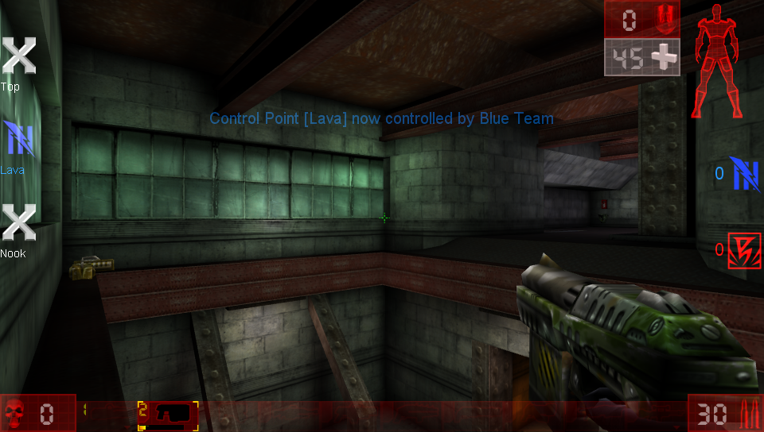

# Unreal Tournament Vita

<p align="center"></p>

This is a wrapper/port of <b>Unreal Tournament</b> for the *PS Vita*.

The port works by loading the Android ARMv7 executables from the [unofficial Android port by Andiweli](https://github.com/Andiweli/UT99-Android) in memory, resolving their imports with native functions and patching it in order to properly run.
By doing so, it's basically as if we emulate a minimalist Android environment in which we run natively the executables as they are.

## Notes

- The loader has been tested with v.1.5.0 of the Android port.
- Loading times are pretty rough and the game can have framedrops in more chaotic situations.
- Editing Options from in game can brick the ini file. If you want to edit options, edit the ini files in System folder directly.

## Default Controls
- Left Analog: Move
- Right Analog: Aim (Move Cursor in Menus)
- L Trigger: Alternate Fire
- R Trigger: Fire (Click in Menus)
- Cross: Jump
- Square: Crouch
- Triangle: Equip best weapon
- Circle: Equip Slot 0 weapon (Impact Hammer/Traslator)
- Left Arrow: Equip previous weapon
- Right Arrow: Equip next weapon
- Up Arrow: Feign Death
- Down Arrow: Open keyboard for text inputing
- Start: Pause
- Select: Show Score

## Special Options Mapping
There are a few options that are re-used for different purposes on Vita:
- DeadZoneXYZ: Deadzone for the left analog.
- DeadZoneRUV: Deadzone for the right analog.
- ScaleXYZ: Scale used for gyro aiming.
- ScaleRUV: Scale used for right analog aiming.
- InvertY: Invert Y axis for gyro aiming.
- InvertV: Invert Y axis for right analog aiming.
- UseJoystick: Enables gyro aiming.

The calculation for the aiming is done lossly as follow:
```
FinalAimDelta = ((ScaleXYZ * GyroDelta) + RightAnalogDelta) * ScaleRUV
```

## Changelog

### v.0.6.1

- Fixed a bug causing the directory listing cache to fail with System folder, resulting in crashes accessing some game menus.
- Added extension-full files in the file cache. This will sped up loading times further. (Boot times now down from 41 seconds to 40 seconds)
- Fully disabled debug file logging at engine level.

### v.0.6

- Added directory listing and file lookup caching: this reduces loading times across the whole game.
- Moved to SceLibc usage for I/O. This greatly improves loading times, especially during game boot. (Combined with the previous change, boot time went from 105 seconds to 41 seconds).
- Added the possibility to open the virtual keyboard for text inputing with Down Arrow.
- Moved to vitaGL memory allocators: this should make the game less prone to run out of memory when cycling through maps in the map selector.
- Added a Livearea option to launch the game with a 30 FPS framecap.

### v.0.5

- Initial Release.

## Setup Instructions (For End Users)

- Install [kubridge](https://github.com/TheOfficialFloW/kubridge/releases/) and [FdFix](https://github.com/TheOfficialFloW/FdFix/releases/) by copying `kubridge.skprx` and `fd_fix.skprx` to your taiHEN plugins folder (usually `ux0:tai`) and adding two entries to your `config.txt` under `*KERNEL`:
  
```
  *KERNEL
  ux0:tai/kubridge.skprx
  ux0:tai/fd_fix.skprx
```

**Note** Don't install fd_fix.skprx if you're using rePatch plugin

- **Optional**: Install [PSVshell](https://github.com/Electry/PSVshell/releases) to overclock your device to 500Mhz.
- Install `libshacccg.suprx`, if you don't have it already, by following [this guide](https://samilops2.gitbook.io/vita-troubleshooting-guide/shader-compiler/extract-libshacccg.suprx).
- Install the vpk from Release tab.
- Obtain your copy of *Unreal Tournament v400* legally. This version is the CD release one (non GOTY version). You need only CD 1.
- Place the `Music`, `Maps`, `Sounds`, `System` and `Textures` folders in `ux0:data/ut99`.
- Download the [Android port of UT99 from the Release Tab](https://github.com/Andiweli/UT99-Android/releases/tag/v1.5.0) and open the apk with your zip explorer. Extract the files `libUnrealTournament.so` and `libut99dc_android_bridge.so` from the `lib/armeabi-v7a` folder to `ux0:data/ut99`. 
- Download the zip from Release tab and extract it in `ux0:data/ut99` and replace files when asked.

## Build Instructions (For Developers)

In order to build the loader, you'll need a [vitasdk](https://github.com/vitasdk) build fully compiled with softfp usage.  
You can find a precompiled version here: https://github.com/vitasdk/buildscripts/actions/runs/1102643776.  
Additionally, you'll need these libraries to be compiled as well with `-mfloat-abi=softfp` added to their CFLAGS:

- [SDL2_vitagl](https://github.com/Northfear/SDL/tree/vitagl)

- [libmathneon](https://github.com/Rinnegatamante/math-neon)

  - ```bash
    make install
    ```

- [vitaShaRK](https://github.com/Rinnegatamante/vitaShaRK)

  - ```bash
    make install
    ```

- [kubridge](https://github.com/TheOfficialFloW/kubridge)

  - ```bash
    mkdir build && cd build
    cmake .. && make install
    ```

- [vitaGL](https://github.com/Rinnegatamante/vitaGL)

  - ````bash
    make SOFTFP_ABI=1 NO_DEBUG=1 DEPTH_STENCIL_HACK=1 USE_SCRATCH_MEMORY=1 INDICES_SPEEDHACK=1 install
    ````

After all these requirements are met, you can compile the loader with the following commands:

```bash
mkdir build && cd build
cmake .. && make
```

## Credits

- TheFloW for the original .so loader.
- fgsfds for helping me figure out some weird issues during the porting.
- fl0w for helping out tuning the default settings for gyro aiming.
- enri for the Livearea assets.
- Andiweli for the Android port of ut99dc.
- maximqaxd for ut99dc.
- Northfear for the SDL2 fork with vitaGL as backend.
